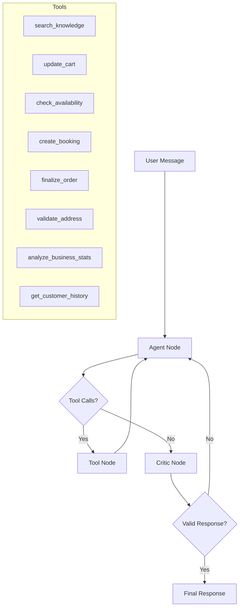

# AgentixAI — Autonomous Business Agent Framework

<p align="center">
  
  
  
  
  
</p>

---

**AgentixAI** is an agentic AI framework that transforms any business document (PDF or text) into a fully autonomous, multi-turn customer service assistant — complete with order management, appointment scheduling, and self-correcting responses.

Drop in a pizza menu, a dental clinic brochure, or a laundry price list — the system automatically extracts business identity, generates domain-specific database tables, and deploys an intelligent agent that enforces your business rules in real time.

---

## Table of Contents

- [How It Works](#how-it-works)
- [Architecture](#architecture)
- [Key Features](#key-features)
- [Project Structure](#project-structure)
- [Tech Stack](#tech-stack)
- [Getting Started](#getting-started)
- [Running Tests](#running-tests)
- [API Endpoints](#api-endpoints)
- [Self-Correction Engine](#self-correction-engine)
- [License](#license)

---

## How It Works

```
Business PDF/Text  →  RAG Ingestion  →  Identity & Rules Extraction  →  Dynamic DB Schema
                                                                              ↓
User Message  →  Agent Node  →  Tool Calls (RAG, Cart, Calendar)  →  Critic Node  →  Response
                      ↑                                                    |
                      └────────────── Self-Correction Loop ────────────────┘
```

1. **Ingest** a business document — the system extracts the business name, type, services, and operational rules using structured LLM output.
2. **Auto-generate** a domain-specific SQL table (e.g., `pizza_orders` with toppings/size columns, or `dental_appointments` with procedure fields).
3. **Chat** — the LangGraph agent handles multi-turn conversations, calling tools for knowledge retrieval, cart management, availability checking, and booking.
4. **Self-correct** — every agent response passes through a Critic node that validates it against business rules. If the agent forgets to ask for a phone number or skips an availability check, the Critic rejects the response and forces a retry.

---

## Architecture



The framework uses a **state machine** built with [LangGraph](https://github.com/langchain-ai/langgraph). The graph has three core nodes:

| Node | Role |
|------|------|
| **Agent** | Processes user input, decides which tools to call, generates responses |
| **Tools** | Executes business operations (RAG search, cart updates, bookings, address validation) |
| **Critic** | Evaluates the agent's response against business rules; triggers self-correction if rules are violated |

---

## Key Features

### Knowledge-First RAG with LLM Relevance Filtering
The RAG engine doesn't just return the top-k similar chunks. It retrieves candidates via ChromaDB vector search, then passes them through an **LLM relevance filter** that discards chunks that don't actually answer the user's question.

### Dynamic Schema Injection
When a business document is ingested, the system uses structured LLM output to design a domain-specific SQL table schema. A pizzeria gets `pizza_orders` with columns like `topping`, `size`, `crust_type`. A dental clinic gets `dental_appointments` with `procedure`, `tooth_number`. This happens automatically at ingestion time.

### Smart Calendar & Conflict Detection
The agent **must** call `check_availability` before every booking. If a slot is taken, the agent tells the user and asks for an alternative. Double-bookings are architecturally impossible — the Critic node rejects any booking confirmation that lacks a prior availability check.

### Self-Correction Loop (Critic Node)
A separate GPT-4o-mini call with structured output (`Evaluation` schema) evaluates every agent response. The Critic checks:
- Did the agent collect Name and Phone before finalizing an order?
- Did the agent verify calendar availability before confirming a booking?
- Did the agent use `search_knowledge` instead of guessing answers?

If any rule is violated, the agent gets one chance to fix its response before it reaches the user.

### Business Rule Enrichment
During ingestion, the system generates **implicit rules** (e.g., upselling combos, service add-ons) that weren't explicitly stated in the business document. These enriched rules are injected into the agent's system prompt.

### Full Audit Trail
Every tool call, RAG retrieval, and database write is logged to an `audit_logs` table with session tracking.

### Returning Customer Recognition
When a user provides their phone number, the agent calls `get_customer_history` to pull past orders and appointments for personalized service.

### Address Validation
Delivery addresses are verified against OpenStreetMap (Nominatim) to catch invalid addresses before order confirmation.

---

## Project Structure

```
├── agent/                  # LangGraph agent logic
│   ├── graph.py            # State machine: Agent → Tools → Critic loop
│   ├── tools.py            # 13 business tools (RAG, cart, calendar, orders, etc.)
│   └── state.py            # TypedDict definitions for agent memory
│
├── app/                    # FastAPI application
│   ├── main.py             # Chat & ingestion endpoints
│   └── routers/            # Admin and analytics routes
│
├── rag/                    # Retrieval-Augmented Generation engine
│   ├── engine.py           # PDF/text ingestion, chunking, LLM relevance filtering
│   └── instance.py         # Shared RAG singleton
│
├── db/                     # Database layer
│   ├── database.py         # SQLAlchemy engine & session factory
│   ├── models.py           # Schema: BusinessProfile, Session, Order, Appointment, AuditLog
│   └── crud.py             # Create/read/update/delete operations
│
├── data/                   # Runtime storage
│   ├── pdfs/               # Uploaded business documents
│   └── chroma_db/          # ChromaDB vector store (auto-generated)
│
├── templates/              # HTML templates (if serving frontend)
├── tests/                  # Test suites
├── test_run.py             # End-to-end conversation simulator
├── check_audit.py          # Utility: inspect audit logs
├── check_logs.py           # Utility: inspect session logs
├── check_counts.py         # Utility: inspect record counts
├── start_project.bat       # Windows startup script
├── start_project.ps1       # PowerShell startup script
├── requirements.txt        # Python dependencies
└── .env.example            # Environment variable template
```

---

## Tech Stack

| Component | Technology |
|-----------|-----------|
| **Agent Orchestration** | [LangGraph](https://github.com/langchain-ai/langgraph) |
| **LLM** | OpenAI GPT-4o-mini |
| **Embeddings** | OpenAI Embeddings |
| **Vector Database** | ChromaDB (local, persistent) |
| **Backend API** | FastAPI + Uvicorn |
| **ORM** | SQLAlchemy |
| **Database** | SQLite (dev) / PostgreSQL (production-ready) |
| **Address Validation** | Geopy + OpenStreetMap Nominatim |
| **Structured Output** | Pydantic models for LLM schema enforcement |

---

## Getting Started

### Prerequisites
- Python 3.10+
- OpenAI API Key

### Installation

```bash
# Clone the repository
git clone https://github.com/<your-username>/AgentixAI.git
cd AgentixAI

# Create and activate virtual environment
python -m venv venv

# Windows
.\venv\Scripts\activate

# macOS/Linux
source venv/bin/activate

# Install dependencies
pip install -r requirements.txt
```

### Configuration

Copy the example environment file and add your API key:

```bash
cp .env.example .env
```

Edit `.env`:
```env
OPENAI_API_KEY=your_openai_api_key_here
USE_SQLITE=True
DATABASE_URL=sqlite:///./sqlite.db
```

### Run the Server

```bash
uvicorn app.main:app --reload
```

The API will be available at `http://localhost:8000`. Interactive docs at `http://localhost:8000/docs`.

---

## Running Tests

The project includes an end-to-end test script that simulates full conversation flows:

```bash
python test_run.py
```

This will:
1. Reset the local database
2. Ingest a sample business profile (Mario's Pizza)
3. Seed a calendar conflict (Table 5 booked at 6 PM)
4. Run two scripted conversations:
   - **Bob (Ordering)**: Browse menu → add items → provide contact → confirm order
   - **Alice (Scheduling)**: Attempt busy slot → find alternative → book → reschedule → cancel
5. Output results to `final_test_summary.txt`

### Utility Scripts

```bash
python check_audit.py    # View audit logs for a session
python check_logs.py     # View session conversation history
python check_counts.py   # View record counts across tables
```

---

## API Endpoints

| Method | Endpoint | Description |
|--------|----------|-------------|
| `POST` | `/chat` | Send a message and receive an agent response |
| `POST` | `/ingest` | Upload a business PDF/text for RAG ingestion |
| `GET` | `/docs` | Interactive Swagger documentation |

---

## Self-Correction Engine

The Critic node is what separates AgentixAI from a standard RAG chatbot. Here's how it works:

```
Agent generates response
        ↓
Critic evaluates response against business rules
        ↓
┌─── Valid? ───┐
│              │
Yes            No → feedback sent back to Agent (max 1 retry)
│              │
↓              ↓
User sees     Agent regenerates with specific fix instructions
response      (e.g., "You forgot to ask for their phone number")
```

**Rules enforced by the Critic:**
- Customer name and phone must be collected before any order or booking is finalized
- `check_availability` must be called before `create_booking` — no exceptions
- Menu/pricing questions must be answered via `search_knowledge`, not from memory
- Upselling should be offered during active ordering sessions

The retry limit is capped at **1 attempt** to prevent infinite loops.

---

## License

This project is open source and available under the [MIT License](LICENSE).

---

<p align="center">
  Built with LangGraph, OpenAI, and FastAPI
</p>
